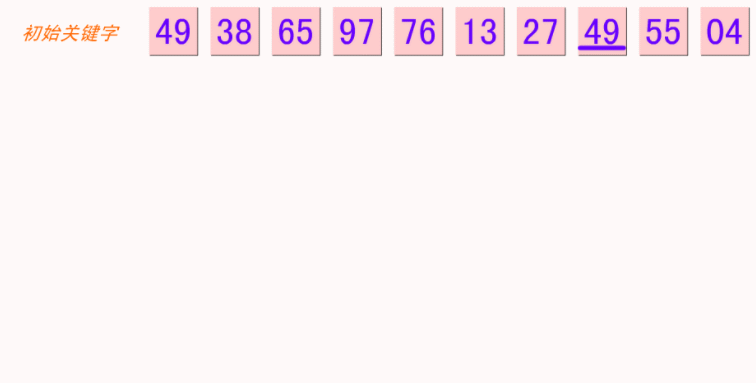

### 排序算法

#### 冒泡排序

##### 算法步骤：

1. 比较相邻的元素。如果第一个比第二个大，就交换他们两个; 
2. 对每一对相邻元素作同样的工作，从开始第一对到结尾的最后一对。这步做完后，最后的元素会是最大的数; 
3. 针对所有的元素重复以上的步骤，除了最后一个; 
4. 持续每次对越来越少的元素重复上面的步骤，直到没有任何一对数字需要比较。

<!-- more -->

##### 动图演示


##### 代码

```javascript
function bubbleSort(arr) {
    let len = arr.length;
    let temp = null;
    for (let i = 1; i < len; i++) {
        for (let j = 0; j < len; j++) {
            if (arr[j] > arr[i]) {
                temp = arr[i];
                arr[i] = arr[j];
                arr[j] = arr[i];
            }
        }
    }
}
```

#### 选择排序

##### 算法步骤：

1. 首先在未排序序列中找到最小（大）元素，存放到排序序列的起始位置；
2. 再从剩余未排序元素中继续寻找最小（大）元素，然后放到已排序序列的末尾；
3. 重复第二步，直到所有元素均排序完毕。

##### 动图演示


##### 代码

```javascript
function selectionSort(arr) {
    let len = arr.length;
    let minIndex, temp;
    for (let i = 0; i < len - 1; i++) {
        minIndex = i;
        for (let j = i + 1; j < len; j++) {
            if (arr[minIndex] > arr[j]) {
                minIndex = j
            }
        }
        temp = arr[minIndex];
        arr[minIndex] = a[i];
        a[i] = temp;
    }
    return arr;
}
```

#### 选择排序

##### 算法步骤

1. 将第一待排序序列第一个元素看做一个有序序列，把第二个元素到最后一个元素当成是未排序序列；
2. 从头到尾依次扫描未排序序列，将扫描到的每个元素插入有序序列的适当位置。（如果待插入的元素与有序序列中的某个元素相等，则将待插入元素插入到相等元素的后面。）

##### 动图演示


##### 代码

```javascript
function insertionSort(arr) {
    let len = arr.length;
    let preIndex, cur;
    for (let i = 1; i < len; i++) {
        preIndex = i - 1;
        cur = arr[i]
        while (preIndex >= 0 && arr[preIndex] > cur) {
            arr[preIndex + 1] = arr[preIndex];
            preIndex--;
        }
        arr[preIndex] = current;
    }
    return arr;
}
```

#### 希尔排序

##### 算法步骤

1. 选择一个增量序列 t1，t2，……，tk，其中 ti > tj, tk = 1；
2. 按增量序列个数 k，对序列进行 k 趟排序；
3. 每趟排序，根据对应的增量 ti，将待排序列分割成若干长度为 m 的子序列，分别对各子表进行直接插入排序。仅增量因子为 1 时，整个序列作为一个表来处理，表长度即为整个序列的长度。

##### 动画演示



##### 代码

```javascript
function shellSort(arr) {
    let len = arr.length;
    let gap = 1,
        temp;
    while (gap < len / 3) {
        gap = gap * 3 + 1;
    }
    for (gap; gap > 0; gap = Math.floor(gap / 3)) {
        for (let i = gap; i < len; i++) {
            temp = arr[i];
            let j = i - gap;
            for (j; j >= 0 && arr[j] > temp; j -= gap) {
                arr[j + gap] = arr[j];
            }
            arr[j + gap] = temp;
        }
    }
    return arr;
}
```

#### 归并排序

##### 算法步骤

1. 申请空间，使其大小为两个已经排序序列之和，该空间用来存放合并后的序列；
2. 设定两个指针，最初位置分别为两个已经排序序列的起始位置；
3. 比较两个指针所指向的元素，选择相对小的元素放入到合并空间，并移动指针到下一位置；
4. 重复步骤 3 直到某一指针达到序列尾；
5. 将另一序列剩下的所有元素直接复制到合并序列尾。

##### 动画演示


##### 代码

```javascript
function mergeSort(arr) { // 采用自上而下的递归方法
    var len = arr.length;
    if (len < 2) {
        return arr;
    }
    var middle = Math.floor(len / 2),
        left = arr.slice(0, middle),
        right = arr.slice(middle);
    return merge(mergeSort(left), mergeSort(right));
}

function merge(left, right) {
    var result = [];

    while (left.length && right.length) {
        if (left[0] <= right[0]) {
            result.push(left.shift());
        } else {
            result.push(right.shift());
        }
    }

    while (left.length)
        result.push(left.shift());

    while (right.length)
        result.push(right.shift());

    return result;
}
```
