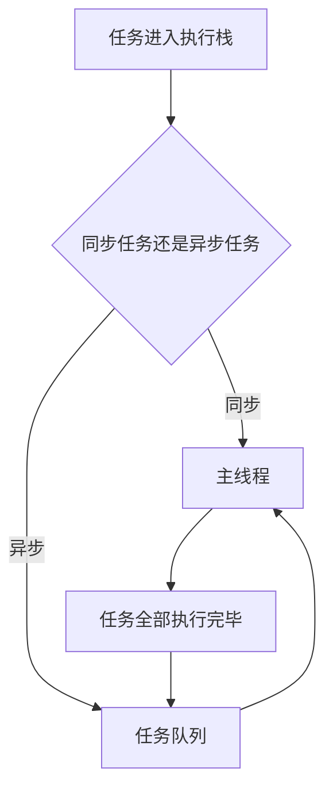
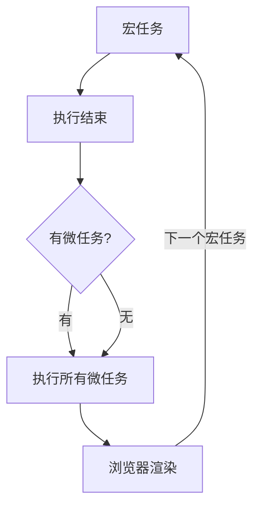

### js的EventLoop

作为浏览器脚本语言，JavaScript的主要用途是与用户互动，以及操作DOM。这决定了它只能是单线程，否则会带来很复杂的同步问题。比如，假定JavaScript同时有两个线程，一个线程在某个DOM节点上添加内容，另一个线程删除了这个节点，这时浏览器应该以哪个线程为准？
所以，为了避免复杂性，从一诞生，JavaScript就是单线程.

<!-- more -->

由于js是单线程的, 只有当上一个任务完成之后才会继续完成下一个任务, 如果前一个任务耗时很长，后一个任务就不得不一直等着。于是，所有任务可以分成两种，一种是同步任务（synchronous），另一种是异步任务（asynchronous）。

#### 同步任务

在主线程上排队执行的任务，只有前一个任务执行完毕，才能执行后一个任务；

#### 异步任务

不进入主线程、而进入"任务队列"（task queue）的任务，只有"任务队列"通知主线程，某个异步任务可以执行了，该任务才会进入主线程执行。



1. 所有同步任务都在主线程上执行，形成一个执行栈（execution context stack）。
2. 主线程之外，还存在一个"任务队列"（task queue）。只要异步任务有了运行结果，就在"任务队列"之中放置一个事件。
3. 一旦"执行栈"中的所有同步任务执行完毕，系统就会读取"任务队列"，看看里面有哪些事件。那些对应的异步任务，于是结束等待状态，进入执行栈，开始执行。
4. 主线程不断重复上面的第三步。
主线程从任务队列中读取事件, 这个过程是不断循环的, 所以整个的运行机制称为EventLoop

#### MacroTask（宏任务）

宏任务: macrotask 可以理解是每次执行栈执行的代码就是一个宏任务（包括每次从事件队列中获取一个事件回调并放到执行栈中执行, 每一个宏任务会从头到尾将这个任务执行完毕，不会执行其它）包括整体代码script，setTimeout，setInterval、setImmediate（浏览器暂时不支持，只有IE10支持，具体可见MDN）、I/O、UI Rendering。

#### MicroTask（微任务）

微任务: MicroTask 可以理解是在当前 task 执行结束后立即执行的任务，包括Process.nextTick（Node独有）、Promise、Object.observe(废弃)、MutationObserver

```javascript
setTimeout(function() {
    console.log('1');
})
new Promise(function(resolve) {
    console.log('2');
    resolve() // 加上resolve可执行.then里面的方法
}).then(function() {
    console.log('3');
})
console.log('4');
//打印顺序 2 4 3 1
```

首先整体代码是一个宏任务, 遇到setTimeout, 会创建另一个宏任务, 接着执行当前的宏任务, Promise 新建后就会立即执行。所以会首先打印2，then方法是一个微任务，遇到then，添加到微任务队列，代码接着执行会打印4。此时宏任务执行完毕，接着就会检查当前微任务队列是否有微任务，如果有，立即执行当前的微任务（也就是then 打印3），当前微任务执行完毕之后，开始执行下一轮的宏任务setTimeout，会打印1。



```javascript
setTimeout(function() {
    console.log(1)
}, 0);

new Promise(function(resolve, reject) {
    console.log(2)
    for (var i = 0; i < 10000; i++) {
        if (i === 800) {
            console.log(10)
        }
        i == 9999 && resolve();
    }
    console.log(3)
}).then(function() {
    console.log(4)
})

setTimeout(function() {
    console.log(9);
    new Promise(function(resolve) {
        console.log(7);
        resolve();
    }).then(function() {
        console.log(8)
    })
}, 0);
console.log(5);

//打印顺序 2 10 3 5 4 1 9 7 8
```

首先整体代码是一个宏任务, 遇到setTimeout, 会创建另一个宏任务, 接着执行当前的宏任务, Promise 新建后就会立即执行。所以会首先打印2 10 3 , then方法是一个微任务，遇到then，添加到微任务队列，代码接着执行会打印5。遇到第二个setTimeout，创建第三个宏任务。此时宏任务执行完毕，接着就会检查当前微任务队列是否有微任务，如果有，立即执行当前的微任务（也就是then 打印4），当前微任务执行完毕之后，开始执行下一轮的宏任务，打印 1, 当前宏任务无微任务，进入下一轮宏任务，打印 9，Promise 新建后就会立即执行，打印7，接着执行微任务里的then，打印 8。
